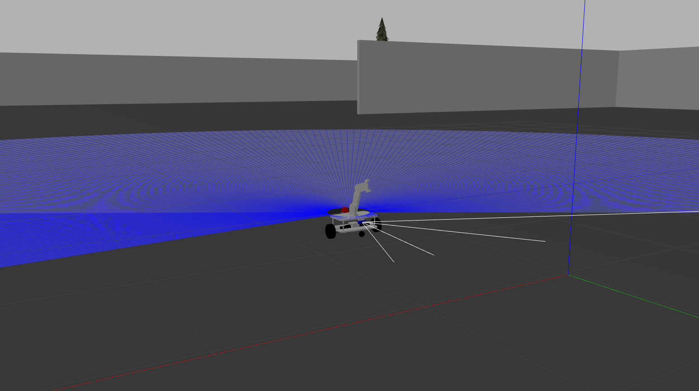
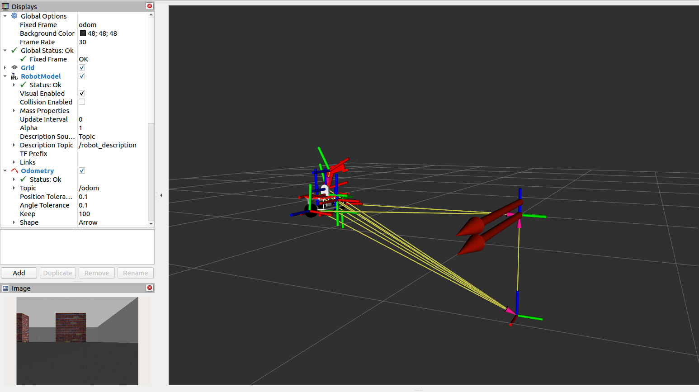
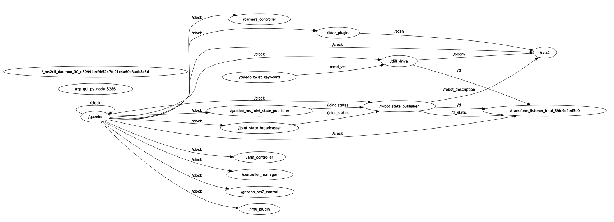

Dự án giữa kỳ môn Lập trình Robot với ROS RBE3017

Thông tin sinh viên thực hiện:  
Họ và tên: Lê Trọng Nghĩa  
MSSV: 23020754  
Ngành học: Kỹ thuật Robot.  
Đơn vị: Đại học Công Nghệ - ĐHQGHN 

Thông tin chung về dự án:  
Dự án mô phỏng robot di động tích hợp tay máy được phát triển trên hệ sinh thái ROS 2 Humble và môi trường Gazebo. Hệ thống bao gồm khung gầm xe tự hành vi sai (Differential Drive) và cánh tay robot 2 bậc tự do (2-DOF), được trang bị các cảm biến không gian (IMU, LiDAR, Camera)

Hình ảnh của dự án:
Robot trong Gazebo:

Robot trong Rviz:


Yêu cầu hệ thống:  
Hệ điều hành: Ubuntu 22.04 LTS  
ROS 2: Humble Hawksbill  
Python: 3.10+  
Các thư viện phụ thuộc (Dependencies):  
  Cài đặt thông qua `apt` và `rosdep`:  
  ```bash
  sudo apt update
  sudo apt install ros-humble-gazebo-ros-pkgs \
                   ros-humble-ros2-control \
                   ros-humble-gazebo-ros2-control \
                   ros-humble-teleop-twist-keyboard \
                   ros-humble-rviz-imu-plugin \
                   ros-humble-joint-state-publisher-gui
```

Cấu trúc thư mục:  
```bash
Assem1/  
├── CMakeLists.txt         # Cấu hình build package   
├── package.xml            # Khai báo metadata và dependencies  
├── README.md              # Tài liệu hướng dẫn  
├── launch/  
│   └── gazebo.launch.py   # File launch chính (All-in-one: Gazebo + Map + RViz2)  
├── urdf/  
│   └── Assem1.urdf        # File mô tả động học và vật lý của Robot  
├── worlds/  
│   └── map.world          # Sa bàn mô phỏng tùy chỉnh  
├── rviz/  
│   └── view_robot.rviz    # File cấu hình bảng điều khiển hiển thị cảm biến  
├── meshes/  
│   └── *.STL              # Các file 3D CAD của robot  
└── safecontrol/  
    └── safe_control.py    # Script Python điều khiển góc quay tay máy an toàn  
```

Hướng dẫn cài đặt:  
1. Clone repository về ROS 2 Workspace của bạn:  
mkdir -p ~/ros2_ws/src  
cd ~/ros2_ws/src  
git clone <link-github>/Assem1.git  
2. Biên dịch package:  
cd ~/ros2_ws  
colcon build --packages-select Assem1  
source install/setup.bash  

Hướng dẫn vận hành: Lần lượt mở 4 Terminal theo trình tự sau:  
Terminal 1: Khởi động cốt lõi (Gazebo, Map, Robot & RViz2)  
cd ~/ros2_ws  
source install/setup.bash  
export GAZEBO_MODEL_PATH=$GAZEBO_MODEL_PATH:~/ros2_ws/src/  
ros2 launch Assem1 gazebo.launch.py  

Terminal 2: Kích hoạt Hệ thống điều khiển (ros2_control)  
source ~/ros2_ws/install/setup.bash  
ros2 run controller_manager spawner joint_state_broadcaster  
ros2 run controller_manager spawner arm_controller  

Terminal 3: Điều khiển di chuyển xe (Teleop)  
source /opt/ros/humble/setup.bash  
ros2 run teleop_twist_keyboard teleop_twist_keyboard  

Terminal 4: Điều khiển tay máy (Gửi tham số góc quay)  
source ~/ros2_ws/install/setup.bash  
cd ~/ros2_ws/src/Assem1/safecontrol/  
python3 safe_control.py 0.5 -0.8   

Dữ liệu cảm biến và node giao tiếp:  
LiDAR (2D Laser Scan): Quét qua topic /scan ở tần số 10Hz, tầm nhìn 8 mét.  
Camera RGB: Đẩy luồng video trực tiếp qua topic /front_camera/image_raw (30 FPS).  
IMU: Trả về gia tốc tuyến tính và vận tốc góc qua topic /imu/data.

Sơ đồ luồng giao tiếp (RQT Graph):


